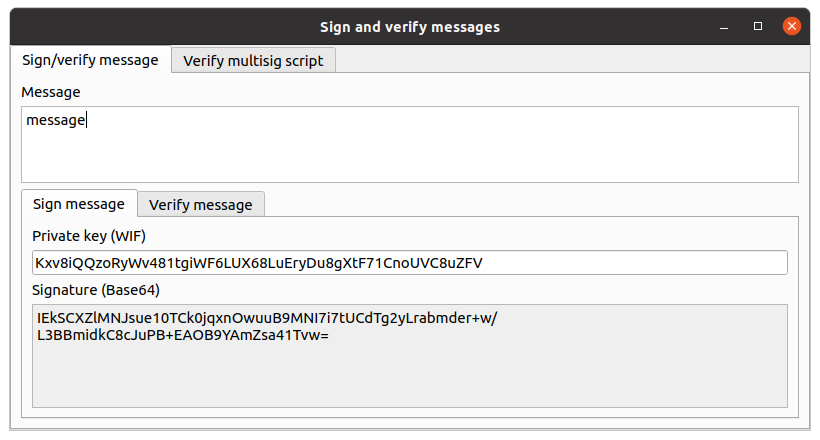
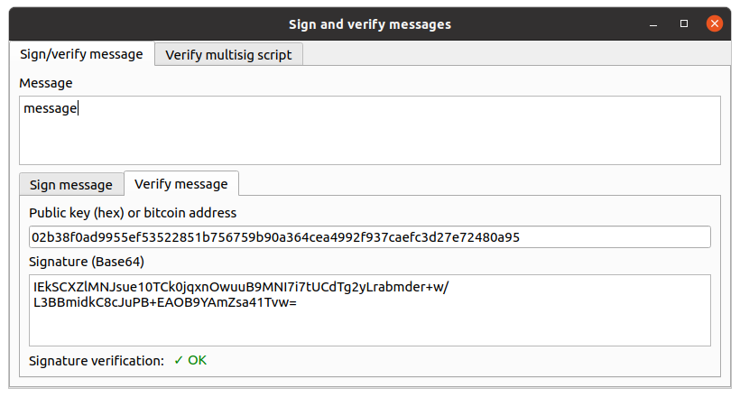
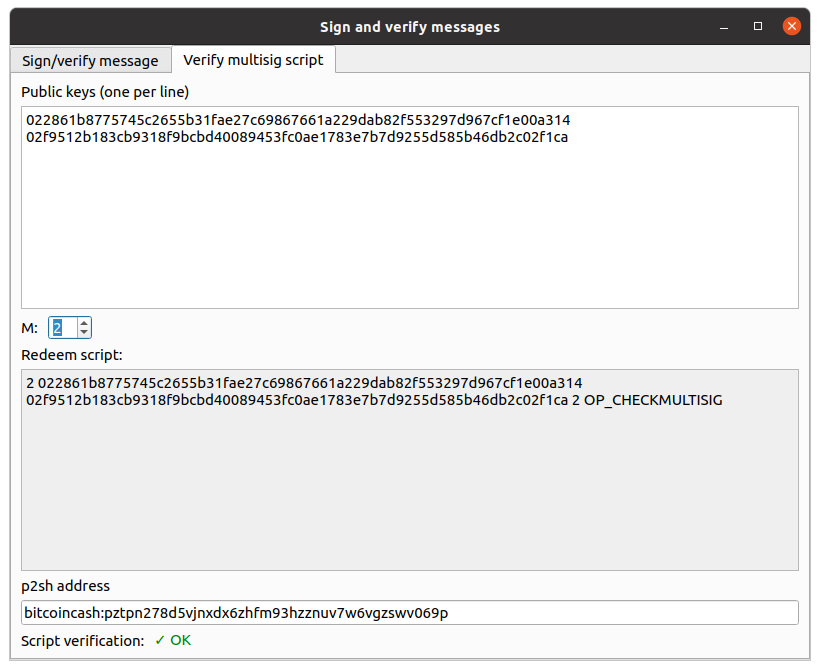

# signverify
This is a desktop GUI application to sign and verify a message using bitcoin private/public keys.

## Install

This application requires Python 3 (>= 3.6).

```shell
git clone git@github.com:Bitcoin-ABC/ElectrumABC.git
cd ElectrumABC
pip install . --user
cd ..
git clone git@github.com:PiRK/signverify.git
cd signverify
pip install . --user
```

This installs a python package called `signverify`, and also a script
(package entry point) with the same name.

It also takes care of installing all the required dependencies defined
in the `setup.py` files of Electrum ABC and this package.

## Run the application

After installing the package with `pip install .`, you should be able to run
the application from a terminal simply by calling the `signverify` command.

If you want to run the local code in the repository, to be able to immediately
see the changes you make to the code, you can run the application using the command
`python -m signverify`. You need to be in the root directory for the repository
for this to work, else python will execute the `signverify` package previously installed
on the Python lib path.

## Screenshots






